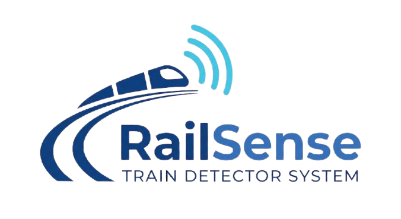

<p align="center">
  
</p>

<h1 align="center">🚆 RailSense</h1>
<p align="center">
  <strong>Intelligent Railway Crossing & Traffic Light Interlocking System</strong><br />
  <em>Sistem Keselamatan Perlintasan Sebidang Berbasis Computer Vision & Aktuasi Lampu Lalu Lintas Cerdas</em>
</p>

<p align="center">
  
  
  
  
  
</p>

---

## 📌 1. Latar Belakang & Ringkasan Proyek

Kecelakaan pada perlintasan sebidang rel kereta api di Indonesia sering kali terjadi bukan semata-mata karena kelalaian masinis, melainkan akibat **antrean kendaraan bermotor (bus, mobil, atau motor) yang terjebak di tengah rel akibat kemacetan di persimpangan jalan di belakangnya saat palang pintu mulai tertutup**.

**RailSense** adalah sistem keselamatan cerdas berbasis *Computer Vision (Instance Segmentation)* dan *Real-Time Interlocking System*. Sistem ini memantau area perlintasan kereta melalui kamera CCTV secara otomatis. Jika terdeteksi adanya kendaraan atau rintangan yang terjebak saat palang tertutup, sistem secara instan mengirimkan sinyal kendali untuk **mengubah lampu lalu lintas (traffic light) di persimpangan jalan belakangnya menjadi KUNING lalu MERAH**, memblokir arus kendaraan yang masuk, mengurai kemacetan, dan membunyikan peringatan darurat sebelum kereta melintas.

---

## 🚦 2. Logika Keselamatan (*Safety Decision Matrix*)

Sistem RailSense mengklasifikasikan kondisi operasional menjadi 3 aturan logika utama:

| Kondisi | Status Palang | Kondisi Zona Rel | Status Sistem | Aksi Traffic Light & Alarm |
| :---: | :---: | :---: | :---: | :--- |
| **Kondisi 1** | Terbuka (*Open*) | Arus kendaraan ramai/normal | 🟢 **SAFE** | **HIJAU** (Arus lalu lintas berjalan normal). |
| **Kondisi 2** | Tertutup (*Closed*) | Zona rel bersih tanpa halangan | 🟢 **SAFE** | **HIJAU / NORMAL INTERLOCK** (Kereta lewat tanpa rintangan). |
| **Kondisi 3** | Tertutup (*Closed*) | **Kendaraan / Objek terjebak di rel** | 🔴 **DANGER** | **KUNING ➔ MERAH** (Stop arus kendaraan belakang) + **Alarm Darurat AKTIF**. |

---

## 🧠 3. Model Computer Vision (AI Engine)

* **Arsitektur Model**: **YOLOv8 Nano Instance Segmentation (`yolov8n-seg.pt`)**
* **Keunggulan Segmentasi**: Tidak hanya membuat kotak *bounding box*, melainkan menghasilkan arsiran poligon (*pixel-level mask*) presisi tinggi yang melacak lekukan kendaraan yang melanggar batas rel.
* **Target Kelas**:
  1. `[0] danger`: Kendaraan/rintangan yang terjebak di zona rel saat palang tertutup.
  2. `[1] safe`: Palang terbuka normal atau perlintasan bersih tanpa gangguan.
* **Hardware Akselerasi**: Dilatih dan dioptimalkan dengan akselerasi **NVIDIA GPU (CUDA)**.

---

## 🏗️ 4. Arsitektur Sistem

```text
[ CCTV Stream / Video Feed ]
              │ (RTSP / HLS / Video File)
              ▼
    [ Python Backend (FastAPI) ]
              │
              ├──▶ [ OpenCV Frame Ingestion & Buffer ]
              │
              ├──▶ [ YOLOv8-seg Inference Engine (CUDA) ]
              │
              ├──▶ [ Safety Decision & Smoothing Filter ]
              │
              └──▶ [ WebSocket Broadcaster (sub-50ms) ]
                               │
                               ▼
            [ Frontend Web Dashboard (Next.js + TypeScript) ]
              ├── 🖼️ Image Upload & Interactive AI Detection (Default View)
              ├── 📺 Floating Live CCTV Stream Preview (Hover on Top)
              ├── 🚦 Digital Traffic Light Interlocking Simulator
              └── 🚨 Alarm Peringatan Darurat
```

---

## 📁 5. Struktur Direktori Proyek yang Rapi

```text
RailSense/
├── TrainSense-Logo.png       # Logo resmi RailSense (.PNG)
├── README.md                 # Dokumentasi utama proyek
├── best.pt                   # Bobot model YOLOv8-seg terbaik hasil training
├── yolov8n-seg.pt            # Pretrained base model segmentasi
├── yolov8n.pt                # Pretrained base model deteksi
├── train_model.ipynb         # Notebook training GPU lokal (CUDA)
├── test_model.ipynb          # Notebook verifikasi & simulasi interlocking
│
├── datasets/                 # Manajemen dataset terstruktur
│   ├── dataset_tambahan/     # 52 Data poligon utama (danger vs safe)
│   ├── seg_dataset/          # Dataset aktif hasil split train (80%) & valid (20%)
│   └── archive/              # Arsip dataset eksperimen sebelumnya
│       ├── Danger/
│       ├── Safe/
│       ├── Standby/
│       ├── custom_dataset/
│       ├── dataset/
│       ├── label/
│       └── rail-road-crossing.v1i.yolov8/
│
├── frontend/                 # Web Dashboard (Next.js 14 + TypeScript + Tailwind)
│   ├── app/
│   │   ├── page.tsx          # Landing page (Image Detection + Hover Live CCTV)
│   │   ├── layout.tsx
│   │   └── globals.css
│   ├── public/               # Asset statis (logo.png, sample images)
│   └── package.json
│
└── backend/                  # API & Engine Inferensi (FastAPI)
    ├── main.py               # WebSocket & REST API server
    └── requirements.txt
```

---

## 🚀 6. Panduan Menjalankan Sistem

### A. Uji Coba Model di VS Code
Buka file **`test_model.ipynb`** di VS Code untuk menguji kemampuan segmentasi poligon dan simulasi respons lampu lalu lintas.

### B. Menjalankan Frontend Web (Next.js)
```bash
cd frontend
npm run dev
```
Buka browser pada alamat: **`http://localhost:3000`**

Fitur di halaman utama:
1. **Input Gambar**: Unggah foto perlintasan kereta untuk dideteksi oleh AI (*SAFE* vs *DANGER*).
2. **Preset 1-Klik**: Uji cepat menggunakan sampel kasus nyata (Bus Terjebak, Palang Tertutup Bersih, Palang Terbuka).
3. **Hover CCTV Monitor**: Arahkan kursor ke tombol **"Live CCTV Streams"** di bilah navigasi atas untuk melihat live feed tanpa berpindah halaman.

---

## 🔮 7. Roadmap Pengembangan
- [x] Kurasi dataset spesifik (52 gambar poligon Danger vs Safe).
- [x] Training model Instance Segmentation dengan akselerasi GPU (CUDA).
- [x] Validasi logika keselamatan & simulasi respons traffic light.
- [x] Frontend Web Next.js TypeScript dengan Image Upload & Hover CCTV Monitor.
- [ ] Implementasi integrasi WebSocket realtime antara backend FastAPI dan frontend.
- [ ] Pengujian lapangan dengan mikrokontroler IoT (ESP32) untuk aktuator traffic light fisik.

---
**RailSense Team** © 2026. *Building Smarter, Safer Crossings with Computer Vision.*
